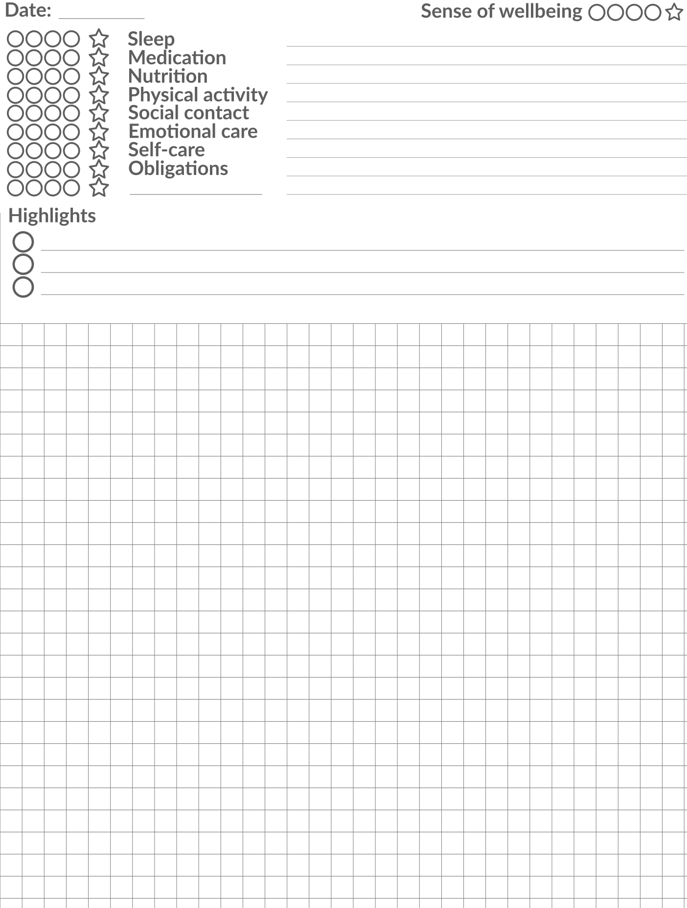

# Self-care Journal Template

<strong>This is a self-care journal template for 10" Digital Notebooks. Whether you're going through a difficult time, or simply like to keep a structured journal, this template can be of great assistance.</strong><br/>
<br/>
Designed by a person diagnosed with Borderline Personality Disorder (DSM-V), a condition known for heightened sensitivity to mental crises, this template is part of a set of supporting tools to surviving a mental crisis.<br/>
<br/>
Although this template is designed for Digital Notebooks, you can print these out on paper too.
<br clear="left"/>

## Installation (Onyx Boox)
To use this template, download the template PNG file on your Digital Notebook. On the Digital Notebook, in the `Storage` section, move the file to the `Storage/noteTemplate` directory. Now you can use this template from the `Custom` section in you Note application.

## Usage & Guidelines
Journaling during a mental crisis is widely recognized as a benificial practice. It provides a safe outlet for expressing emotions, helping individuals process their thoughts and feelings. Writing things down can offer clarity and perspective, reducing the intensity of overwhelming emotions. Through journaling patterns and triggers can be identified, which is invaluable for understanding and managing mental health. By fostering self-reflection and mindfulness, journaling empowers individuals to navigate their crises with greater resilience and insight.

### Section 1: the basics
In a period of crisis, it's essential to pay attention to the basics. For some, for example, simply getting out of bed can be a significant achievement, while others may find themselves compulsively engaging in physical activities. Concrete actions must be taken decisively, focusing on maintaining a balance - relative to your _normal functioning_. This section is not about self-judgement, but being mindful of balancing key aspects of your life during a crisis. If you're like me, when you pick up this guide, you might initially score zero in all areas. And that is okay. Acknowledging and addressing your crisis is a valuable first step; recognising this indicates your awareness and willingness to live through this situation.

- The four circles are to indicate how well you have managed to focus on and carry out this aspect
- The star represents 'the extra mile'; us it when you have done more that what is usual for you during normal functioning
- The provided line is for additional notes. For example: during my 'forced' daily walk, I sometimes have pleasant conversations with passersby; which I then note under 'social contact' 

#### Sleep
We have a circadian rythm wich contributes to our health...
#### Medication
When struggling with physical of mental difficulties, chances are you have a medication routine ...
#### Nutrition
As complex carbon-based lifeforms, we need nutrition for keeping our bodies healthy...
#### Physical Activity
As pointed out by many research, physical activity increases positive feelings and energy...
#### Social Contact
We are social creatures, maintaining healthy social relations ...
#### Emotional Care
Taking care of the inner emotional world of our being. Therapy, Mindfulness, Meditation, ...
#### Self-Care
Taking care of our bodies, our living conditions, ...
#### Obligations
Things that just need to be done (e.g. filing taxes) ...

#### The blank line
In your process, you might pay special attention to something personal to you. You can use the blank line for keeping track of this personal aspect.


```
"We are shaped by evolution, but we manage to have a lot of wiggle room with that"
- Robbert Sapolsky
```
While we don't control how we feel, we do have control over our behaviors...

### No-Zero Principle
This principle can be used in several situations; something is better than nothing. For example: if you aim to walk 5km each day for attenting to your needs for physical exercise, when you're having a really bad day don't just skip the walk, walk 100 meters instead. This way you achieved _no zero_. Through the no-zero principle; you may find that starting the activity is actually more difficult than keeping it going once you've started, inhibiting inertia and assisting you in acting on your intentions.

### The peaks
Within a period of crisis, we might experience periods of emotional overwhelm. These are moments when, for example, you feel like you are (almost literally) drowning in despair, and there is no way out. These are moments which make us vulnerable to destructive behaviors; anything to escape this feeling. Understand that, while incredibly intense and blackening out any perspective, __this too shall pass__. Allow yourself to feel these emotions, allow yourself to feel their intensity, but don't let it to absorb you, don't go along with it, and __allow this wave to roll over. It will.__

#### Crisis Medication
While I strongly recommend you train yourself in accepting these moments, allowing these to pass and finding your anchors to hold on to while the wave hits (i.e. build resilience), do discuss _crisis medication_ and their correct use with your (mental) health professional, and take these as prescribed when you're losing grip. I sometimes compare it to Mario Kart: when, for some reason, you totally lost control and drove way too far of the road, this cloud comes to pick you up to put you back on the track - that's what some products (e.g. Alprazolam) can accomplish. But these products are, probably for this exact reason, very addictive (!).

### Suicidal Tendencies
It is not so much that you want to die, as it is that you just need to get the f#ck out of here - and there seems to be no (other) way out. You just can't go on living like _this_. You just can't. And it feels like nothing or no one is going to save your. Everything collapses onto you - there is no conceptualization or perspective of "tomorrow" or even "in a minute". It's like the air raid alarm is blaring deafeningly loud and the only thing your whole being is screaming is to __get the f#ck out! now! now!__. Your mind is panicked looking for the nearest exit; a kitchen knife, the rope, ... . If you have **Crisis Medication**, now is the time. If you don't, call an ambulance. **This too shall pass**, I know your life is reduced to this exact moment and your feelings cannot conceptualize living even one moment longer - but bring yourself to (physical) safety, and allow yourself another chance.

## Disclaimer
This is merely a tool for supporting your journey through challenging times. When in a state of crisis, it is important to reach out to your support network and (mental) health professionals. When you have a condition which makes you vulnerable to crises, make sure you have this support network in place and ready to fall back on, because in a state of accute crisis it can be challenging to have to start seeking the right support.

## License & Collaboration
**Copyright© 2024 Sanne 'SpuQ' Santens**. This template project is licensed under the **[GNU GPLv3](https://www.gnu.org/licenses/gpl-3.0.en.html)**.

If you'd like to contribute to this project, please follow these guidelines:
1. Fork the repository and create your branch from `main`.
2. Make your changes and ensure they adhere to the project's coding style and conventions.
3. Test your changes thoroughly.
4. Ensure your commits are descriptive and well-documented.
5. Open a pull request, describing the changes you've made and the problem or feature they address.
